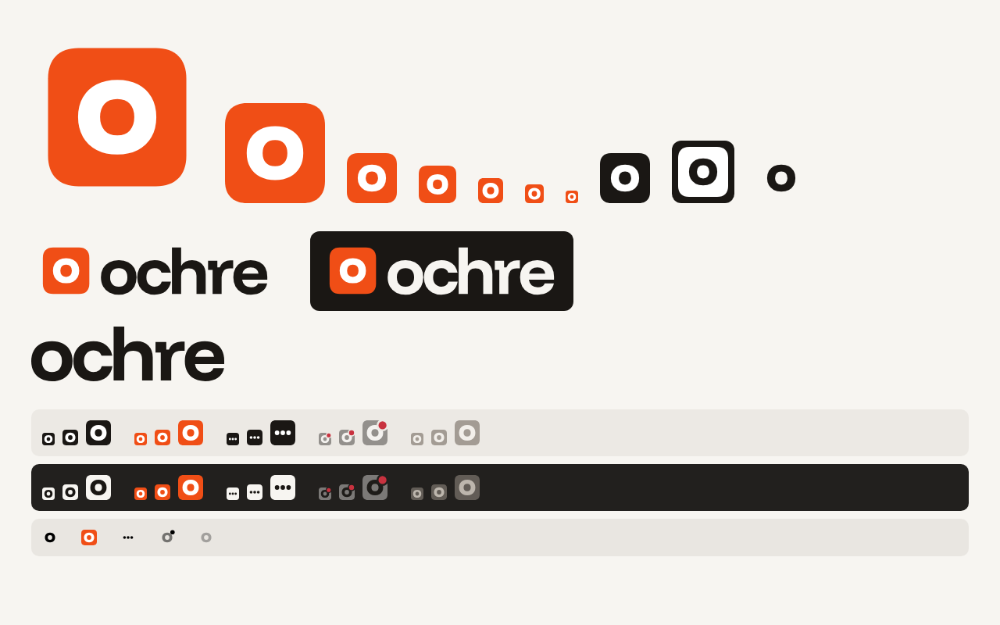

# Ochre brand: implementation handoff

For: the coding agent working in the Ochre repo. From: the design pass on 2026-10-05.
Everything in `svg/` is final artwork. Don't redraw it; wire it in.



## Decisions (final)

| Area | Decision |
|---|---|
| App icon | Funnel Display ExtraBold lowercase **o**, outlined, white on a vermilion squircle. It replaces the wave-into-caret mark. |
| Small sizes | At ≤ 32 px use `ochre-icon-small.svg`, where the o fills 62% of the tile instead of 54% so the counter stays open at 16 px. |
| Wordmark | **ochre**, lowercase, Funnel Display Bold at −0.045em tracking, outlined in `ochre-wordmark.svg`. It replaces the serif "Whisperflow" wordmark. |
| Display type | **Funnel Display replaces Instrument Serif everywhere.** Use weight 700 and −0.04em tracking for headlines. Instrument Sans (UI) and Geist Mono stay as they are. |
| Colour | Unchanged vermilion. The icon tile is `#F04E16` (= `--accent-2`). `--accent #D4400E`, `--accent-ink #C23A0C` and the dark-mode `#FF8552` stay as they are. |
| Naming | "Ochre" in prose, `ochre` in the CLI and in the wordmark. |

## Files in this package

```
svg/
  ochre-icon.svg               master tile, 100-unit grid, use >= 48 px
  ochre-icon-small.svg         small cut, use <= 32 px (favicon, tray, small .ico)
  ochre-icon-macos.svg         1024 canvas, 824 body at offset 100 (Apple grid), no shadow
  ochre-icon-mono-black.svg    ink tile, white o
  ochre-icon-mono-white.svg    white tile, ink o
  ochre-glyph.svg / -small     bare o, no tile
  ochre-wordmark.svg / -white  outlined "ochre"
  ochre-lockup-horizontal.svg / -dark   icon + wordmark, clear space included
  favicon.svg
  tray/ochre-tray-{idle,recording,busy,error,off}-{light,dark}.svg
  tray/macos/ochre-template-{idle,busy,error,off}.svg   black and alpha only (template images)
  tray/macos/ochre-recording.svg                        the one colour menu-bar image
fonts/FunnelDisplay-{500,600,700,800}.woff2 + OFL.txt   (OFL 1.1, Latin subset)
tokens/ochre-brand.css         @font-face + --font-display; merge into tokens.css
scripts/build_icons_reference.py   working reference build (tested): .ico, .icns, Linux PNG, Tauri, tray PNG
preview/overview.png
```

## Tasks

1. **Icon sources.** Copy `svg/*` into `app/icons/src/` (with `tray/` and `tray/macos/` as subfolders). Remove the old wave/caret sources once nothing references them.
2. **Build script.** Port `scripts/build_icons_reference.py` into `app/icons/build_icons.py`, keeping any existing output paths and CLI the repo depends on. Key rules:
   - ≤ 32 px → `ochre-icon-small.svg`; ≥ 48 px → `ochre-icon.svg`; `.icns` → `ochre-icon-macos.svg`.
   - Build `.ico` from per-size renders (16, 24, 32, 48, 64, 256), not by downscaling the 256.
   - Pillow's `.icns` writer skips the 16@1x and 32@1x entries. On macOS, prefer `iconutil -c icns` on an `.iconset` built from the same renders.
   - Add the macOS system shadow (0 10 20 at 30% black) only if the build already does that for `.icns`. Never put it in the SVG.
3. **Tauri.** Point `bundle.icon` in `tauri.conf.json` at the regenerated `32x32.png`, `128x128.png`, `128x128@2x.png`, `icon.icns` and `icon.ico`. Regenerate the `Square*Logo.png` and `StoreLogo.png` files if they're present.
4. **Tray and menu-bar states** (behaviour as in docs/design.md §4; only the art changes):
   - idle: ink tile + white o on light taskbars, paper tile + ink o on dark taskbars
   - recording: hero tile + white o (same in both themes)
   - busy: tile with three dots
   - error: tile at 42% opacity + `#C8323F` badge (top-right, ringed in the taskbar colour)
   - off: grey tile
   - macOS: template images for idle, busy, error and off (`setTemplate(true)`); recording uses the colour image (`setTemplate(false)`).
   - Pick light or dark from the OS theme, the same way the current tray code does. Render at 16, 20 and 32 px plus @2x.
5. **Fonts.** Self-host the Funnel Display woff2 files beside the existing fonts and merge `tokens/ochre-brand.css` into `app/ui/theme/tokens.css`. Change every use of Instrument Serif (display headings, the onboarding title, any serif accents) to `var(--font-display)` with `font-weight: 700` and `letter-spacing: -0.04em`. Funnel Display has no italic, so remove the italic accents or set them in the regular style. Drop the Instrument Serif files and @font-face rules once nothing uses them. Then run `python app/ui/theme/contrast-check.py`.
6. **Wordmark in the app.** Wherever the old "Whisperflow" wordmark appears (About, onboarding, Settings header), use `ochre-wordmark.svg` or the horizontal lockup. Rename user-visible "Whisperflow" strings to "Ochre".
7. **Favicon.** Use `favicon.svg` plus a 32 px PNG fallback from the build script, for the docs site or README site if there is one.
8. **Small assets** (build as HTML or SVG and export PNG; spec below).
9. **Brand sheet.** Write `docs/brand/index.html`, a single self-contained page following the spec below.

## Specs for the remaining assets

Shared rules: paper `#F7F5F1` or ink `#1A1714` background, flat, and one hero colour. Headlines use Funnel Display 700 at −0.04em; supporting text uses Instrument Sans; versions and specs use Geist Mono. Don't use gradients, glows, sparkles, soundwaves or circles around the mark.

- **GitHub social / OG, 1280×640:** paper background, horizontal lockup at the top-left (icon 80 px). Headline at about 76 px: "Hold a key, talk, and the text lands where you type." Footer line in Instrument Sans 26 px, ink at 70%: "Free, local, open-source dictation · Windows · macOS · Linux". Optional: the real HUD pill (frosted, live text and caret) at the bottom-right as the only illustration.
- **README header, 1280×320, light and dark:** lockup on the left (icon 88 px). On the right, Funnel Display 44 px: "Talk, and it's typed. Locally." Light is paper/ink; dark is ink with paper text. Swap them with `<picture>` and `prefers-color-scheme`.
- **Hugging Face model-card thumbnail, 1200×630:** ink background, lockup at the top-left in paper. Title "The cleanup model". A one-line description: "Removes the ums, applies 'no wait, make that Tuesday', fixes punctuation. Never rewrites, never answers." Geist Mono footer: model name · params · "runs on-device". Fill in the real values.
- **Brand sheet (`docs/brand/index.html`):**
  - icon, size ladder and one-colour versions
  - wordmark and horizontal lockup, with the clear-space rule (¼ of the icon height on every side)
  - colour table with contrast ratios: `#D4400E` + white 4.63, `#C23A0C` on paper 4.94, `#F04E16` on paper 3.32 (graphic only), `#FF8552` on `#1F1B18` 7.11
  - type: Funnel Display / Instrument Sans / Geist Mono
  - do's and don'ts: no gradients or glow, no circle container, no recolouring toward amber `#EA6A1F`, no sparkles, no stretching
  - the name story: "Ochre is the earth pigment people used for their first marks. The oldest way to make a mark, for the newest way to write."
  - a sample of the HUD pill and the README header in context
  - link the SVGs from `app/icons/src/`

## Constraints to keep

- The icon must stay recognisable at 16 px in a crowded Windows tray. Don't thin the o or shrink it below the small cut.
- Every font is OFL and self-hosted, and the SVG sources are committed.
- All text colour pairs pass WCAG AA. Re-run the contrast check after any token change.
- The icon tile `#F04E16` is never used under text, because white on it is only 3.62:1.
